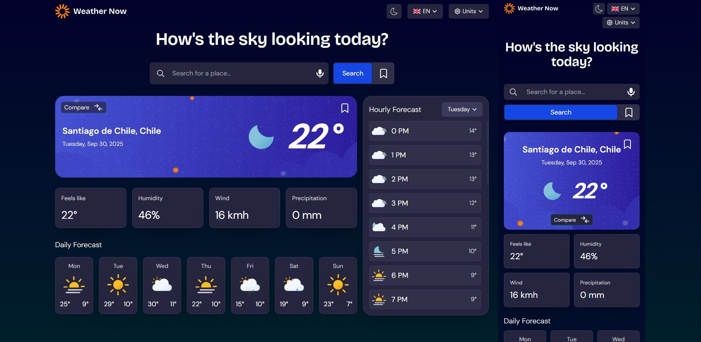

# Frontend Mentor - Weather app solution

This is a solution to the [Weather app challenge on Frontend Mentor](https://www.frontendmentor.io/challenges/weather-app-K1FhddVm49). Frontend Mentor challenges help you improve your coding skills by building realistic projects.

## Table of contents

- [Overview](#overview)

- [The challenge](#the-challenge)

- [Additional features](#additional-features)

- [Screenshot](#screenshot)

- [Links](#links)

- [My process](#my-process)

- [Built with](#built-with)

- [Useful resources](#useful-resources)

- [Author](#author)

## Overview

### The challenge

Users should be able to:

- Search for weather information by entering a location in the search bar

- View current weather conditions including temperature, weather icon, and location details

- See additional weather metrics like "feels like" temperature, humidity percentage, wind speed, and precipitation amounts

- Browse a 7-day weather forecast with daily high/low temperatures and weather icons

- View an hourly forecast showing temperature changes throughout the day

- Switch between different days of the week using the day selector in the hourly forecast section

- Toggle between Imperial and Metric measurement units via the units dropdown

- Switch between specific temperature units (Celsius and Fahrenheit) and measurement units for wind speed (km/h and mph) and precipitation (millimeters) via the units dropdown

- View the optimal layout for the interface depending on their device's screen size

- See hover and focus states for all interactive elements on the page

### Additional features

- Added the ability to switch the app between English and Spanish
- Toggle between English and Spanish languages
- Dark/Light theme switch
- Save favorite locations
- Compare weather between different locations
- Voice search for weather information

### Screenshot

### Links

- Solution URL: [Add solution URL here](https://your-solution-url.com)

- Live Site URL: [Add live site URL here](https://your-live-site-url.com)

## My process

### Built with

- Semantic HTML5 markup

- CSS custom properties

- Flexbox

- CSS Grid

- Mobile-first workflow

- [React](https://reactjs.org/) - JS library

- [Axios](https://axios-http.com/) - JS library to make HTTP request

- [TailwindCSS](https://tailwindcss.com/) - For styles

### Useful resources

- Weather icons inspired by [ArsenTech](https://github.com/ArsenTech) (public weather app repository)

## Author

- Frontend Mentor - [@yourusername](https://www.frontendmentor.io/profile/yourusername)

- Twitter - [@yourusername](https://www.twitter.com/yourusername)
